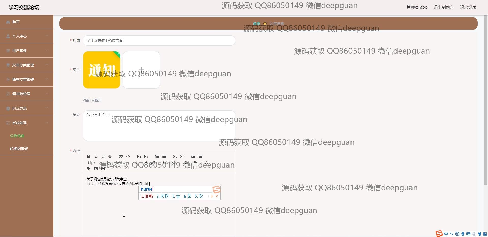

<h1 align="center">基于Java的学习交流论坛+vue</h1>

## 简介
学习交流论坛：角色分为管理员、用户；提供博客管理、论坛交流、文章编辑、公告管理、用户信息管理等功能，支持交互评论、文件上传和系统管理，设计简洁，功能丰富。    --计算机毕业设计源码；毕设源码；java毕业设计源码

## 联系方式

<h3 align="center">获取完整代码与数据库文件 + 微信：deepguan QQ: 86050149 QQ群: 783742310</h3>

<h3 align="center">可帮忙远程部署 包运行成功！提供远程部署、修改代码、设计文档指导、代码讲解等服务！</h3>

## 功能介绍（完整见运行截图）
管理员：基本功能包括登录、注册和退出。提供用户管理、文章分类管理、博客文章管理、留言板管理、论坛交流管理、系统管理以及轮播图管理等后台操作。支持查看、修改和删除用户及帖子，文件上传和图片管理功能，便于维护网站内容。

用户：支持注册、登录、退出功能。个人中心可查看和修改用户信息，包括头像、昵称、联系方式等。支持浏览博客文章、查看公告信息、参与论坛交流及留言反馈。用户可对文章进行收藏、评论、点赞或踩。

访客：可在首页浏览导航栏模块，包括博客文章、论坛交流、公告信息和留言反馈。支持查看文章内容、论坛帖子以及公告详情，但无法进行操作。通过注册可转为用户权限。

博主：支持博客文章的撰写、编辑和发布。可为文章添加分类、图片和详细内容，并管理自己的博客文章，包括查看点击量、评论与互动数据，便于提升内容质量与用户粘性。

## 运行截图

本代码来源于网络,仅供学习参考使用!

